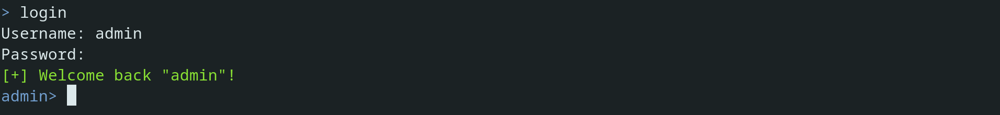
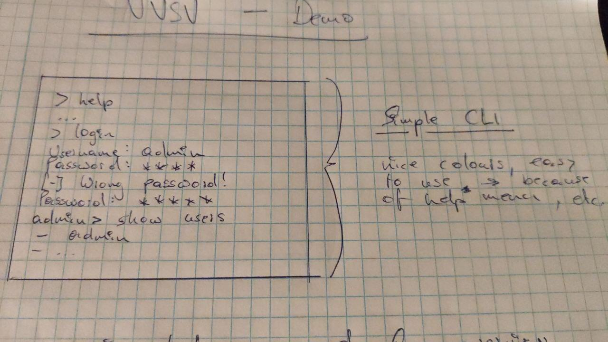

    

<h1 align="center">Demo - Simple User CLI</h1>

---

## ✍️ About

A little Python project to allow for user accounts to be created and logged into. Although I am not entirely certain about the eventual extent of this project, it should at least provide simple user management functionality with a nice codebase.

## 🎨 Scribbles

Some fine little console *scribbles* to allow for an idea of what the final product could look like:

<i>[Scribble 00]: A sketch of what the user's interaction with the CLI might look like</i>

## 🔧 Features

A list of features that are *definitely* and *maybe* going to be implemented.

* ... nice help command for overview
* ... ability to list all user accounts
* ... register new user accounts
* ... log into existing accounts
* ... secure stored accounts by hashing passwords

### Optional

* ... multiple data stores (JSON, SQLite, etc.)
* ... ability to store encrypted data
* ...

---

... Matthias M. (September 2021)
