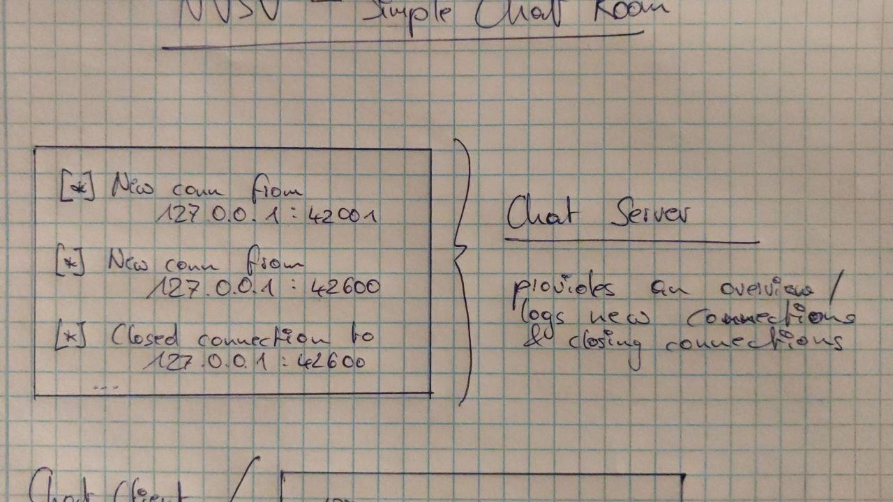
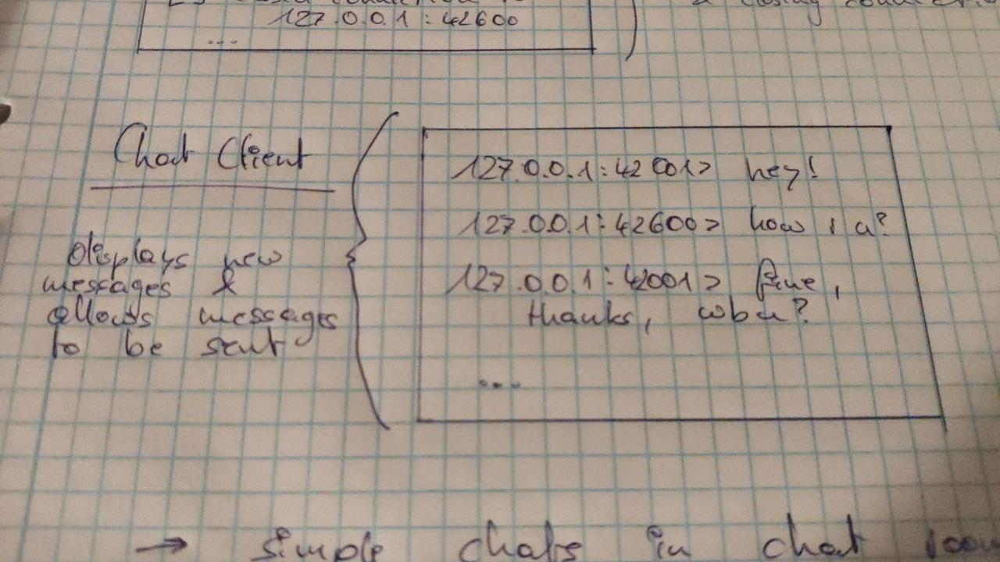

    

<h1 align="center">Simple Chat Room(s)</h1>

---

## ✍️ About

A little Python project to allow for communication via rather simplistic chat rooms. Altough I am not entirely certain about the eventual extent of this project, it should at least provide simple texting functionality between several clients.

## 🎨 Scribbles

Some fine little console *scribbles* to allow for an idea of what the final product could look like:

<i>[Scribble 00]: A sketch of what the server console might look like</i>

<i>[Scribble 01]: A sketch of what the client console might look like</i>

## 🔧 Features

A list of features that are *definitely* and *maybe* going to be implemented.

* ... simple chats in chat rooms
* ... multiple clients can chat in a room
* ... messages can be sent & received *simultaneously*
* ... easy differentiation between own & others messages
* ... easy selection of server & room

### Optional

* ... encrypted messaging
* ... custom usernames (perhaps user accounts)
* ...

---

... Matthias M. (September 2021)
